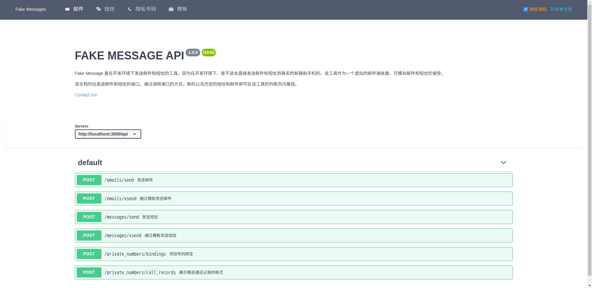

# Fake Messages

> 一个虚拟的邮件、短信和隐私号码的服务提供商

**Fake Messages 是为了开发者而生。** 当我们在平时开发项目时，会遇到发送邮件或短信的行为。拿发送短信为例，如果我们做到真实的发送效果，会遇到以下麻烦：

1. 某条数据存了真实的用户手机号码，从而向真实的用户发送了测试短信。
2. 向开发组内成员发送短信，却发现组内成员的手机号不够用。

Fake Messages 规避了此类风险，并突破了这种限制。

## 产品界面

（这是早期版本的产品界面，当前版本添加了虚拟号码的支持）

### 邮件列表


### 短信列表


### 开发者文档



## 快速上手

### 准备

1. 需要 `node`.
2. 需要 [yarn](https://yarnpkg.com/lang/zh-hans/docs/install).

### 部署

#### 手动部署

```shell
# 克隆代码到本地
git clone https://gitee.com/run27017/fake-messages.git

# 进入项目目录
cd fake-messages

# 安装依赖
yarn

# 准备数据库
bin/init-db

# 打包客户端 js 文件
yarn run build

# 启动服务器
PORT=3000 yarn start
```

可以配置 https，传递环境变量 `SSL_KEY_PATH`、`SSL_CERT_PATH`（只许用 pem 格式）。

#### 使用 Docker

```bash
# 构建镜像
docker image build -t fake-messages .

# 启动容器（将本机的 80 端口映射到容器的 3000 端口，可根据实际需要调整）
docker container run --rm --name fake-messages -p 80:3000 fake-messages
```

### 使用

执行部署命令后，数据库文件会生成到路径 db/default.sqlite3. 服务器成功启动后，访问`http://域名:3000`即可进入项目首页。

提供了文档页，声明了发送邮件和短信的接口。可通过点击右上角的**开发者文档**按钮进入，亦可直接访问：

> http://localhost:3000/#/docs

### 开发

如果需要参与到项目开发，可运行开发环境的命令：

```shell
yarn run dev
```

该命令同时启动了两个开发用的服务：

1. HTTP 服务器
2. Webpack 打包客户端的 js 代码

两个服务都能监听到代码的改动。一旦对应的代码改动，HTTP 服务器会主动重启，Webpack 会重新打包。

其他的有用的开发环境下的命令列举如下：

- `bin/seeds`: 创建一些种子数据。

## 适配器模式

将 Fake Messages 理解为一个服务提供商，将其纳入到你的项目开发中去。在你的项目中，可能会引入多个服务提供商，例如 Mailgun、Submail、阿里云等等。你需要自如地在这些服务商中来回切换，就需要用到适配器模式。

在适配器模式中，首先你需要一个代理类，它作为邮件和短信发送的对外出口。代理类是一个通用的协议，它定义的方法才会直接暴露给开发者。而真正实现邮件和短信的发送的实体类，隐藏在代理类内部，并可自由配置。

例如，我定义的邮件发送代理类（以我最拿手的 Ruby 语言为例）：

```ruby
class EmailSender
    attr_accessor :impl # 真正实现邮件发送的实体对象，发送邮件的动作会转发到该类执行
    
    def send(options)
        # 可能会有一些其他处理，如格式化参数、打印日志、捕获异常等
        impl.send(options)
    end
end
```

假设现在系统内已经有三个服务商的实现：

```ruby
class MailgunEmailSender
end

class SubmailEmailSender
end

class FakeEmailSender
end
```

那我们使用 Mailgun 的实现：

```ruby
sender = EmailSender.new
sender.impl = MailgunEmailSender.new
```

切换到 Submail 的实现也很简单：

```ruby
sender.impl = SubmailEmailSender.new
```

通常我们会在配置文件中配置 adapter，然后在初始化的时候读取。

```ruby
# config/development.settings.yml
EmailSender:
	Adapter: FakeEmailSender

# config/production.settings.yml
EmailSender:
	Adapter: SubmailEmailSender

# config/initializers/email_sender.rb
$email_sender = EmailSender.new
$email_sender.impl = Settings.EmailSender.Adapter.constantize.new
```

如此一来，全局的`$email_sender`变量就是我们的代理类了。它会在开发环境使用`FakeEmailSender`，在生产环境使用`SubmailEmailSender`.

这就是适配器模式的大体思路了，它非常适合这种多服务商实现的场景。像 Java 中的 JDBC，Rails 中的异步任务框架等，其思路也是适配器模式。类似的例子不胜枚举，有兴趣的同学可谷歌“适配器模式”查看更多资料。

## 技术架构

项目的前后端采用完全分离的模式，前端使用 vue 实现单页应用，并调用后端的 JSON 格式的接口，后端使用 Express 框架构建。虽然前后端是完全分离的，但我任然把前后端的代码放在同一个项目内。Express 作为服务器的载体，同时伺服前后端的代码。

目录结构：

- /server：服务器的代码
- /client：客户端的源，它会被 WebPack 打包，生成到 /public 目录下
- /public：静态文件的根目录，其中的 /public/app.js 是 WebPack 打包后的单页代码

基础工具：

- Yarn：替代 npm 工具
- sqlite3：数据库
- websocket：用于实时通信

后端：

- Express：后端框架

前端：

- Webpack：用于打包客户端 js 代码
- Vue：前端框架
- iView：前端 UI
- Sass：CSS 预处理器

## 愿景

虽然这个项目目前很小，实现的功能很基础，但我希望它能够成为像 Mailgun、Submail 那样具有完全功能的项目。 所以我将其开源，希望依靠社区的力量。

## License

[GNU GPL v3](http://www.gnu.org/licenses/gpl-3.0.html)
